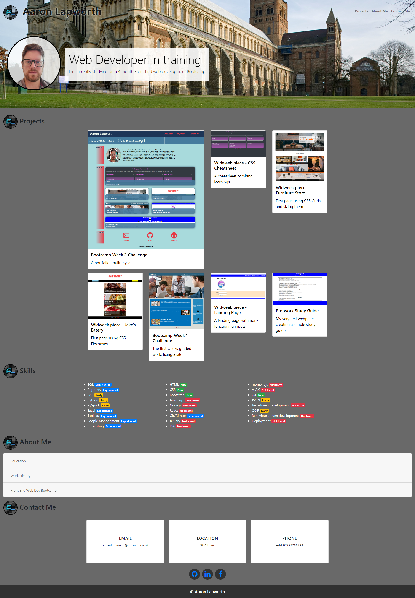

# WK3 Challenge: Personal Portfolio
week 3 challenge - portfolio using bootstrap

## Description

 
This project is to create a personal portfolio website, similar to the previous project, but this time do it using Bootstrap.
Some of the acceptance criteria for this project:

* A Navigation bar
* A navigation menu at the top
* Include links that are applicable to your portfolio
    * Links should navigate to the appropriate sections
* A hero section
    * A jumbotron featuring your picture, your name, and any other information you'd like to include
* A work section
    * A section displaying your work in grid
    * Use bootstrap cards for each project
    * The description should give a brief overview of the work
* A skills section
    * List out the skills you expect to learn from the bootcamp
* An about / contact section
    * An "About Me" section in the same row
* A footer section
    * All hyperlinks should have a hover effect
    * All buttons should display a box shadow upon hover

Website: https://lapworthaaron.github.io/week3_challenge/
 Repository: https://github.com/LapworthAaron/week3_challenge

Some of the elements i have learned and used for:
* Navbar
* Jumbotron
* Cards
* Badges
* CSS Icons
* The site is fully responsive without using media queries

## Table of Contents (Optional)

- [Installation](#installation)
- [Usage](#usage)
- [Credits](#credits)
- [License](#license)

## Installation

Install folder structure as is, into your root directory, then you're good to go.

## Usage

This project has no special usage instructions, it's a simple website.

## Credits

© 2022 Aaron Lapworth. Confidential and Proprietary. All Rights Reserved.

## License

MIT License

Copyright (c) 2022 Aaron Lapworth

Permission is hereby granted, free of charge, to any person obtaining a copy
of this software and associated documentation files (the "Software"), to deal
in the Software without restriction, including without limitation the rights
to use, copy, modify, merge, publish, distribute, sublicense, and/or sell
copies of the Software, and to permit persons to whom the Software is
furnished to do so, subject to the following conditions:

The above copyright notice and this permission notice shall be included in all
copies or substantial portions of the Software.

THE SOFTWARE IS PROVIDED "AS IS", WITHOUT WARRANTY OF ANY KIND, EXPRESS OR
IMPLIED, INCLUDING BUT NOT LIMITED TO THE WARRANTIES OF MERCHANTABILITY,
FITNESS FOR A PARTICULAR PURPOSE AND NONINFRINGEMENT. IN NO EVENT SHALL THE
AUTHORS OR COPYRIGHT HOLDERS BE LIABLE FOR ANY CLAIM, DAMAGES OR OTHER
LIABILITY, WHETHER IN AN ACTION OF CONTRACT, TORT OR OTHERWISE, ARISING FROM,
OUT OF OR IN CONNECTION WITH THE SOFTWARE OR THE USE OR OTHER DEALINGS IN THE
SOFTWARE.